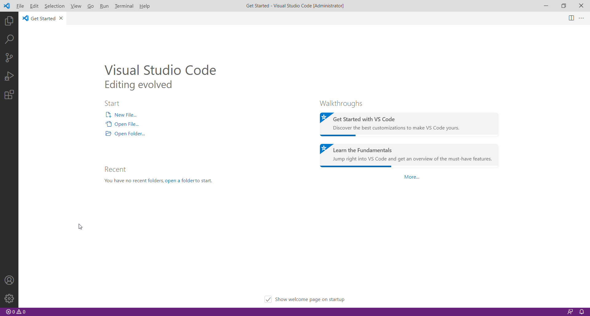
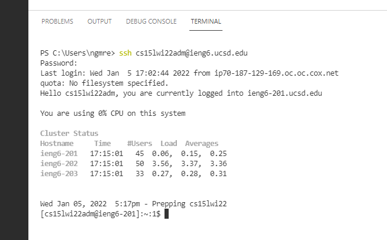
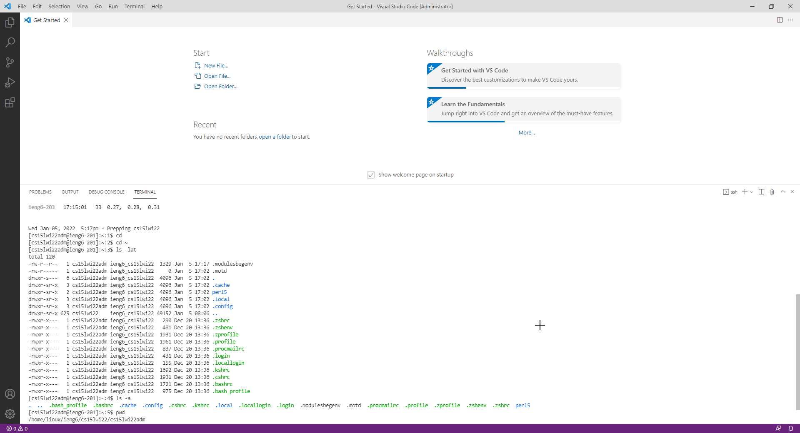
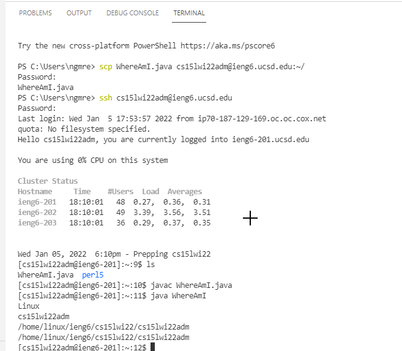
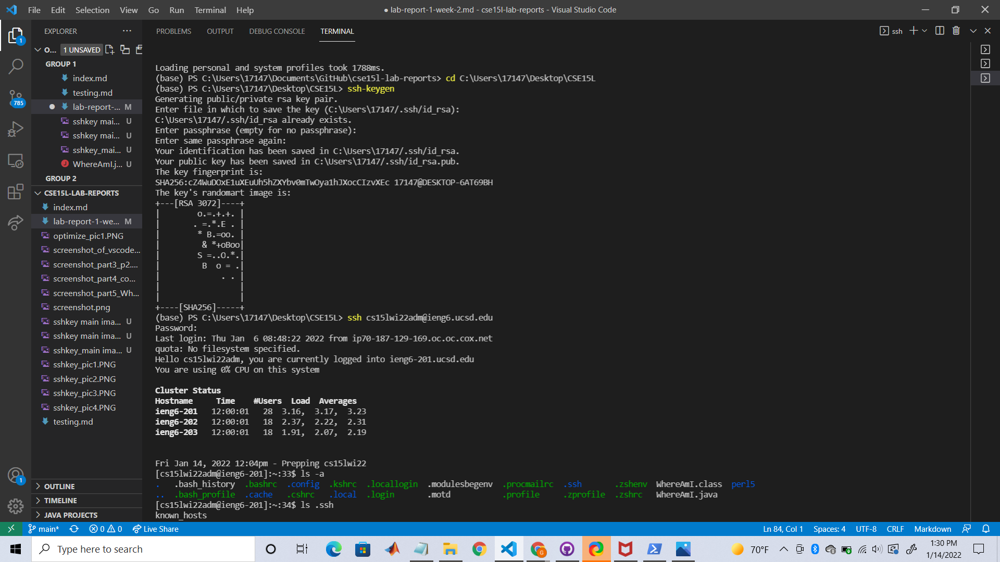
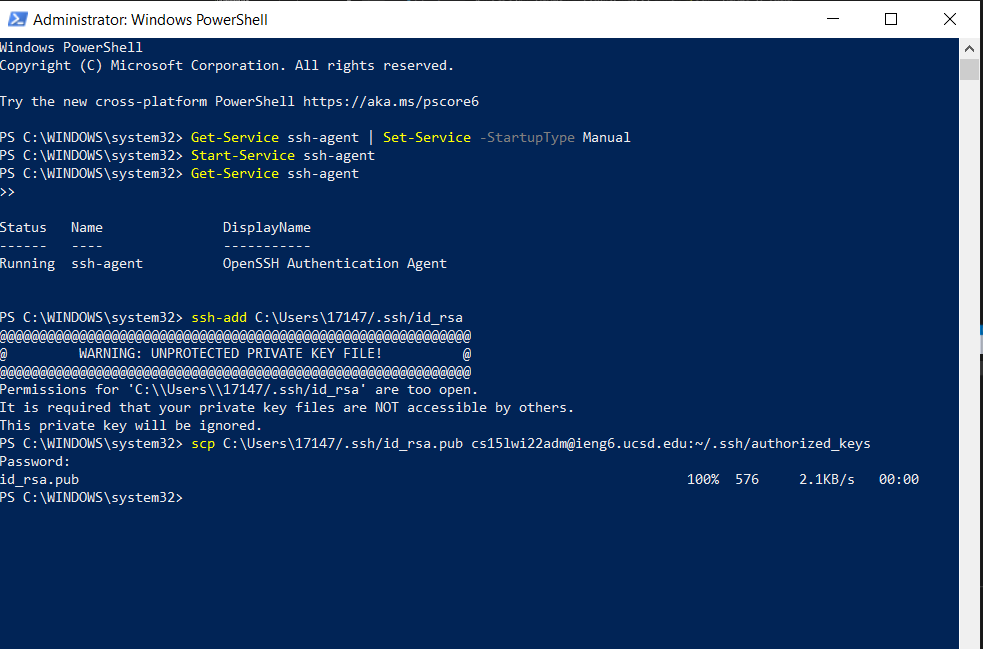
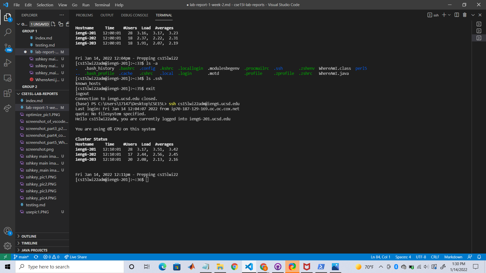
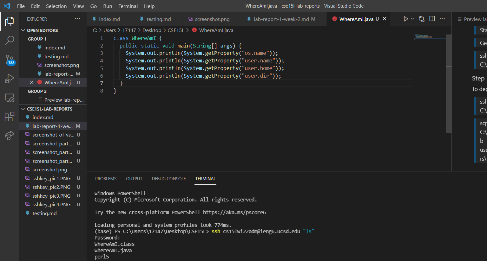

# **Week 2 ~ Lab Report 1**
## Table of Contents
* Installing VScode
* Remotely Connecting
* Trying Some Commands
* Moving Files with scp
* Setting an SSH Key
* Optimizing Remote Running

---

## Installing VSCode
I already had VSCode installed from prior to this class. However, it can easily be installed through this website: [VS Code](https://code.visualstudio.com/).

## Remotely Connecting
### Step 1:
On a Windows laptop, first [Install OpenSSH](https://docs.microsoft.com/en-us/windows-server/administration/openssh/openssh_install_firstuse).
### Step 2:
Find the account for CSE15L in [here](https://sdacs.ucsd.edu/~icc/index.php).
After logging in with your UCSD username and student ID, the account lookup results show up.
Here, you will have to change the password if it's the first time you are working with 
a remote computer. This process takes about 15 minutes to update.
### Step 3:
In the VSCode terminal, run the following command:
> $ ssh cs15lwi22zz@ieng6.ucsd.edu 

Replace "zz" with the code given from this website [here](https://sdacs.ucsd.edu/~icc/index.php).

Now all commands are being run on the server rather than on your own computer(client).
## Trying Some Commands
These are some of the most often used commands:
* cd --> used to change current working directory
* ls -l --> long listing of all files
* ls -a --> all files including hidden files
* cp /home/linux/ieng6/cs15lwi22/public/hello.txt ~/ --> (NOTE: Permission restrictions when trying to read files in last command)

## Moving Files with SCP
### Step 1:
First, make sure that we are running commands from the client and not the server.Then, create a file. 
### Step 2:
From the directory of the file, run this command in the terminal:
> scp WhereAmI.java cs15lwi22zz@ieng6.ucsd.edu:~/

Replace "zz" with the code given from this website [here](https://sdacs.ucsd.edu/~icc/index.php).

### Step 3: 
Enter the password that it prompts for after the previous command

### Step 4:
Log into ieng6 with the ssh command and use the ls command to see the files:
> $ ssh cs15lwi22zz@ieng6.ucsd.edu 

> ls

Through the ls command, you should see the file in the server. Now, when the file is compiled and run, it will be through the server.

## Setting an SSH Key
In order to avoid having to type a password in everytime you use scp, you can create an SSH key that uses the public and private key files created in place of the password.
### Step 1:
On Windows, follow the guidelines given [here](https://docs.microsoft.com/en-us/windows-server/administration/openssh/openssh_keymanagement#user-key-generation).

Run the following command from the powershell:
> ssh-keygen

### Step 2:
Choose the file path you want to save the key in
> Generating public/private ed25519 key pair.

> Enter file in which to save the key (C:\Users\username\.ssh\id_ed25519):

### Step 3: 
Enter the passphrase that is prompted and the public and private keys should been made and saved.
You can also just press enter to not add a passphrase

### Step 4:
Run these commands:
> Get-Service ssh-agent | Set-Service -StartupType Manual

> Start-Service ssh-agent

> Get-Service ssh-agent

> ssh-add  C:\Users\ngmre\.ssh\id_ed25519

### Step 5:
To deploy the key, run these commands:
> ssh cs15lwi22zz@ieng6.ucsd.edu mkdir C:\Users\username\.ssh\

>scp C:\Users\username\.ssh\id_ed25519.pub user1@domain1@contoso.com:C:\Users\username\.ssh\authorized_keys

## Optimizing Remote Running
To run a command and get into the remote server simultaneously to save time, you can use the following command
> $ ssh cs15lwi22@ieng6.ucsd.edu "ls"

Another way to optimize remote running is to run multiple commands at once using semicolons like this:
> $ cp WhereAmI.java OtherMain.java; javac OtherMain.java; java WhereAmI

We want to make a local file called WhereAmI.java file, copying it into the remote server, and then run it. After editing and saving the file, we want to optimize the total time it takes to run the file in the remote server. Using methods to optimize this process would be to: 
> First, copy and paste ssh cse15lwi22zz@ieng.ucsd.edu to get into the remote server since using the up arrow might take more keystrokes

> Second, copy and paste the command to copy into the remote server along with the commands to run the program. This can be done at once using semicolons

> Output: This should have completed the task in fewer than 10 keystrokes

>> Exactly 8 keystrokes

