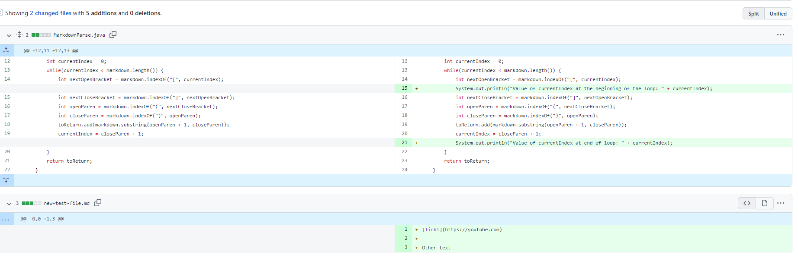
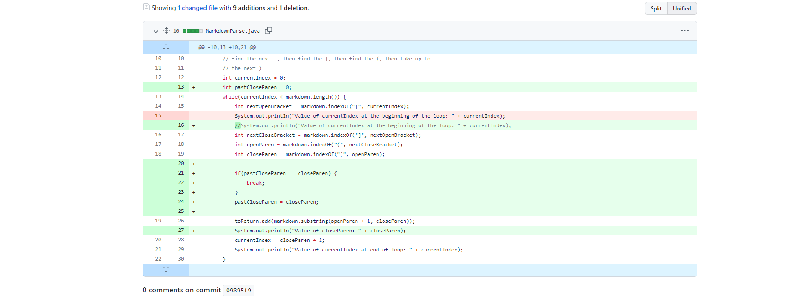
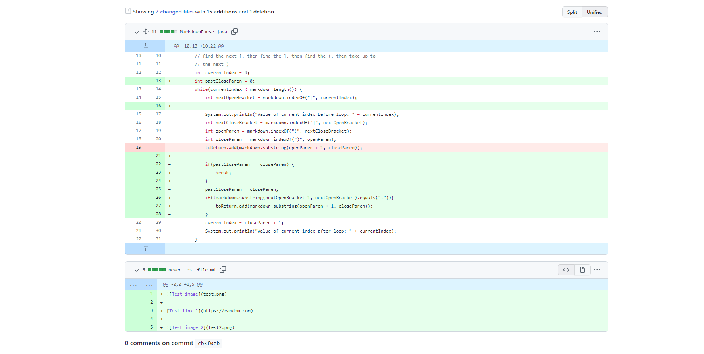
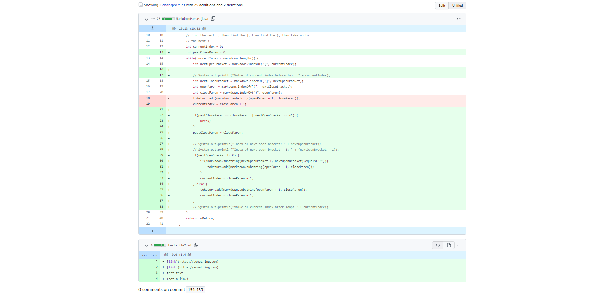

# **Week 4 ~ Lab Report 2**
## Table of Contents
* 1st Code Change
* 2nd Code Change
* 3rd Code Change
---
---
---
## First Code Change ~ Infinite Loop
### Screenshot

### Link to Test File for a Failure-Inducing Input
[Test File](https://github.com/agurel33/markdown-parse/blob/bee0809db8345327e80886f75bf5dbe70fa9502a/new-test-file.md)
### Symptom of Failure Inducing Input
### Description:
#### We had added extra text below the link and the infinite loop error was a result of the fact that it was assumed that the file would end with a link. It would never reach the stopping statement and therefore, cause an infinite loop. To fix this, 
---
## Second Code Change ~ Not adding images to list of links
### Screenshot

### Link to Test File for a Failure-Inducing Input
[Test File](https://github.com/ericwpei/markdown-parse/blob/cb3f0eb4c2ef6a7b773a0aaf4f26cbe7f3c715d3/newer-test-file.md)
### Symptom of Failure Inducing Input
### Description
---
## Third Code Change ~ Link at beginning of the file
### Screenshot

### Link to Test File for a Failure-Inducing Input
[Test File](https://github.com/VivianKwan1/markdown-parse/blob/154e139ad0888c08d484da6b273057fe3bdd278d/test-file2.md)
### Symptom of Failure Inducing Input
### Description
