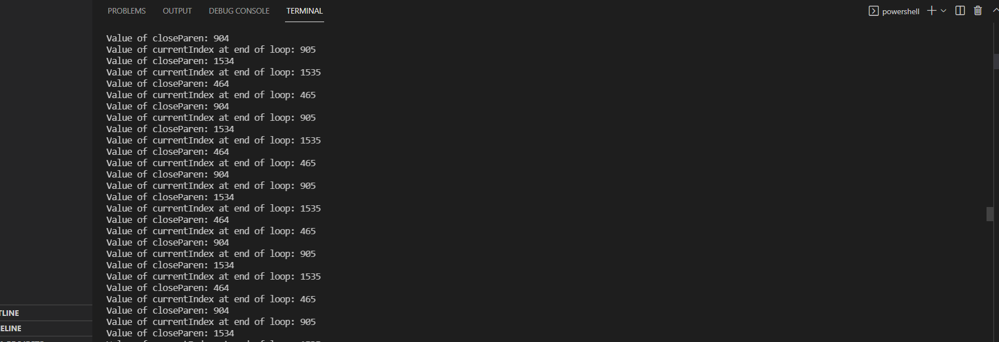
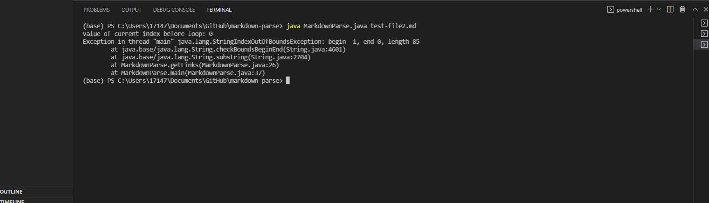
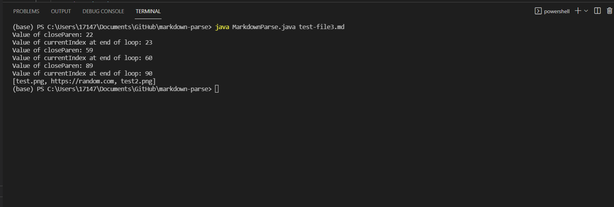

# **Week 4 ~ Lab Report 2**
## Table of Contents
* 1st Code Change
* 2nd Code Change
* 3rd Code Change

---
---
---
## First Code Change ~ Infinite Loop
### Screenshot:

### Link to Test File for a Failure-Inducing Input
[Test File Github](https://github.com/agurel33/markdown-parse/blob/bee0809db8345327e80886f75bf5dbe70fa9502a/new-test-file.md)

[Test File Raw](https://raw.githubusercontent.com/agurel33/markdown-parse/bee0809db8345327e80886f75bf5dbe70fa9502a/new-test-file.md)
### Symptom of Failure Inducing Input:

#### The solution to this was adding a variable that would control when to break out of the loop. So when the pastCloseParen was equal to closeParen, it would get out of the infinite loop.

### Description:
#### We had added extra text below the link and the infinite loop error was a result of the fact that it was assumed that the file would end with a link. It would never reach the stopping statement and therefore, cause an infinite loop.

---
---

## Second Code Change ~ Link at beginning of the file
### Screenshot:

### Link to Test File for a Failure-Inducing Input
[Test File Github](https://github.com/VivianKwan1/markdown-parse/blob/154e139ad0888c08d484da6b273057fe3bdd278d/test-file2.md)

[Test File Raw](https://raw.githubusercontent.com/VivianKwan1/markdown-parse/154e139ad0888c08d484da6b273057fe3bdd278d/test-file2.md)
### Symptom of Failure Inducing Input:

### Description:
#### We added the link in the beginning of the file and it was not being recognized with the given code and had indexing issues. We added a check to see if the first index is a exclamation point or not and if it isn't, it should check for a link.

---
---

## Third Code Change ~ Not adding images to list of links
### Screenshot:

### Link to Test File for a Failure-Inducing Input
[Test File Github](https://github.com/ericwpei/markdown-parse/blob/cb3f0eb4c2ef6a7b773a0aaf4f26cbe7f3c715d3/newer-test-file.md)

[Test File Raw](https://raw.githubusercontent.com/ericwpei/markdown-parse/cb3f0eb4c2ef6a7b773a0aaf4f26cbe7f3c715d3/newer-test-file.md)
### Symptom of Failure Inducing Input:

### Description:
#### We added images to the file with a link in the middle. The bug is that the images printed out as links. Because a image will have an exclamation point at the first index, we added a check to see if there was an exclamation point. If not, continue with adding the substring.

---

