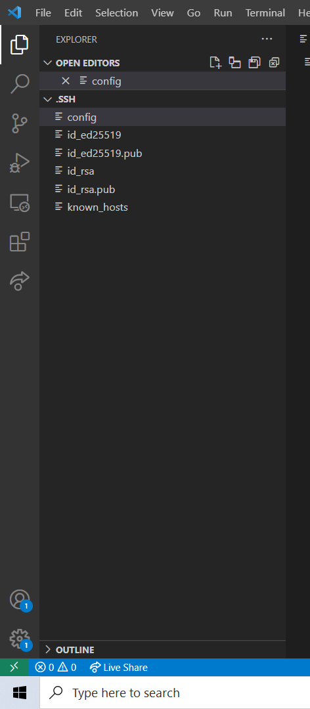
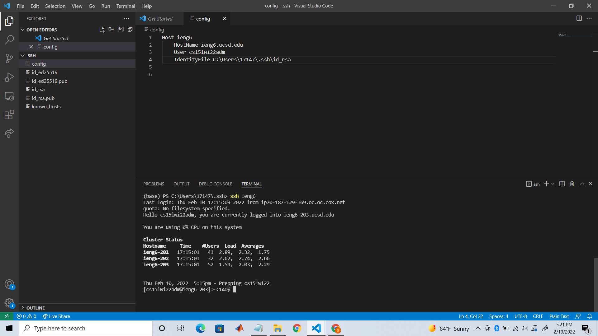
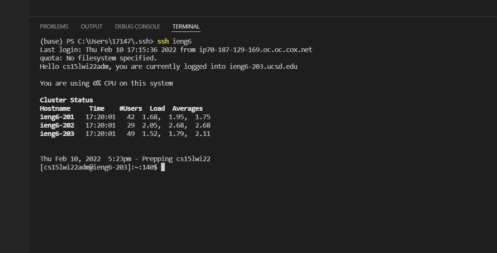
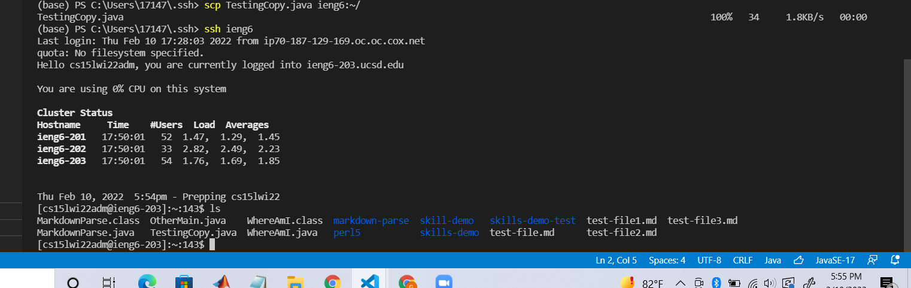

# **Week 6 ~ Lab Report 3**
## Table of Contents
### Streamlining ssh Configuration
* Introduction
* Add Config to .ssh
* Add to Config file
* Use new alias to log in
* Use new alias to copy file

---
---
---
### Introduction
This process is to create a simpler method of logging into the remote account.

---
### Step 1: Add config file to .ssh
If the config file doesn't exist, create a new file and add it to the .ssh folder.

---
### Step 2: Add to config file
Add the following code to the config file:
> Host ieng6  
>> HostName ieng6.ucsd.edu  
>> User cs15lwi22zzz (use your username)

If this doesn't work, then use
> Host ieng6  
    >> HostName ieng6.ucsd.edu  
    >> User cs15lwi22zzz (use your username)  
    >> IdentityFile ~/.ssh/id_rsa_ucsd

---
### Step 3: Use new alias to log into account
Using the following command, we can get into the remote account in a much easier process

---
### Step 4: Use new alias to copy file into account
Using the scp command, I added file TestingCopy.java with ieng6 rather than the old full command

---
