# **Week 8 ~ Lab Report 4**
## Table of Contents
* Introduction
* Snippet 1
* Snippet 2
* Snippet 3
* Follow-up Questions

---
---
---

### Introduction
We are using two repositories in this lab report
1. My markdown-parse repository:
https://github.com/gnamithan/markdown-parse
2. The markdown-parse repository we reviewed: 
https://github.com/yayajjiang/markdown_inperson

---
### Snippet 1
#### Decide on what it should produce by using either VScode preview or the CommonMark demo site
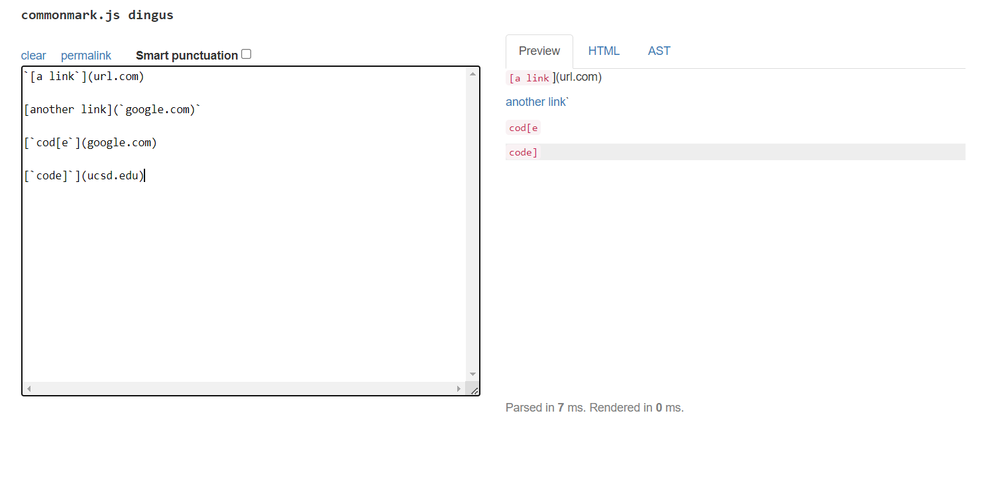
#### Showing the code in MarkdownParseTest.java for how you turned it into a test
1. My markdown-parse:
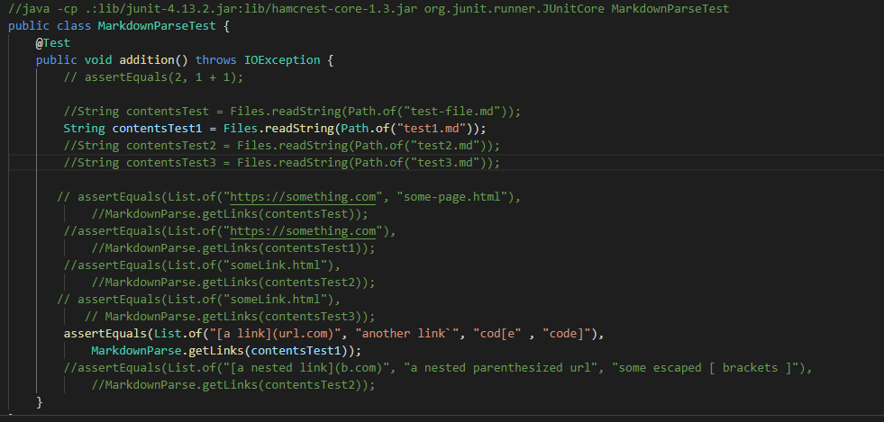
2. The markdown-parse repository we reviewed:
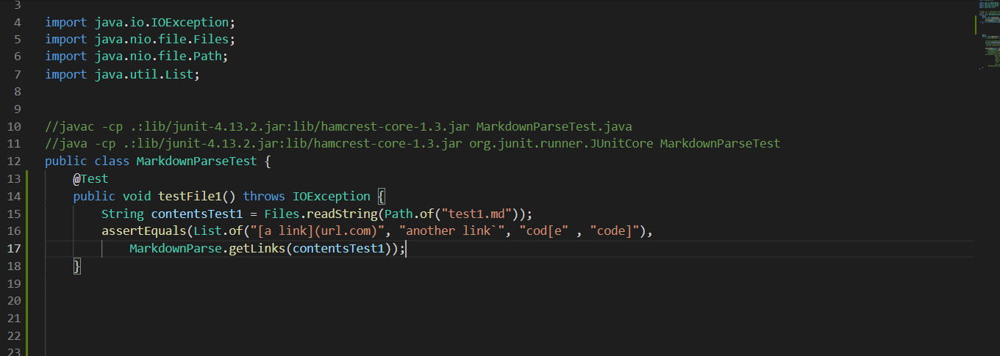
#### For your implementation, the corresponding output when running the tests; if it passed, say so. If it didn’t pass, show the specific part of the JUnit output that shows the test failure.
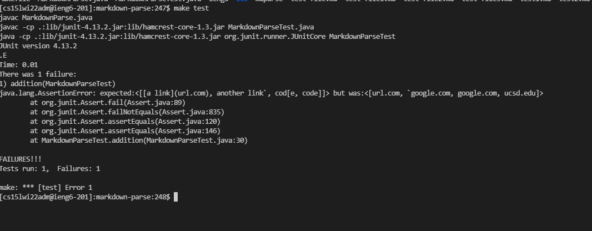
#### For the implementation you reviewed, the corresponding output when running the tests; if it passed, say so. If it didn’t pass, show the specific part of the JUnit output that shows the test failure.
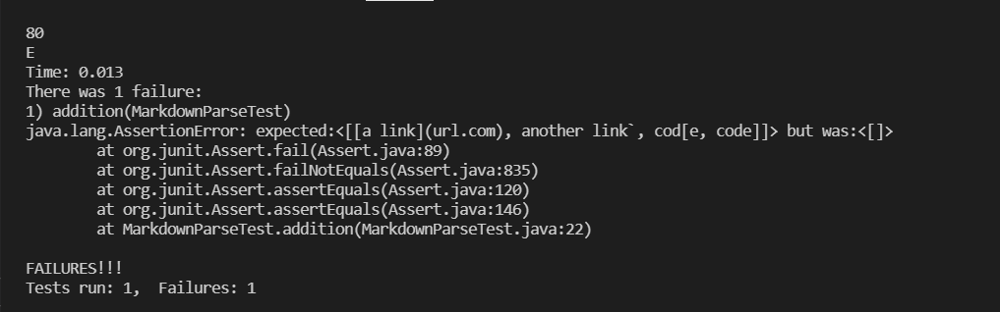

---

### Snippet 2
#### Decide on what it should produce by using either VScode preview or the CommonMark demo site
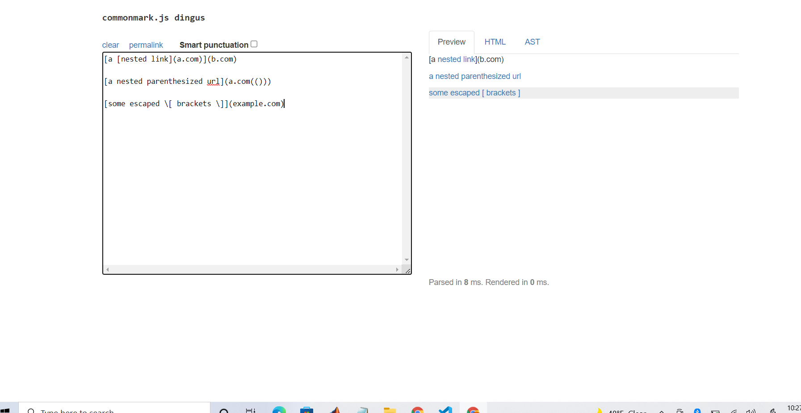
#### Showing the code in MarkdownParseTest.java for how you turned it into a test
1. My markdown-parse:
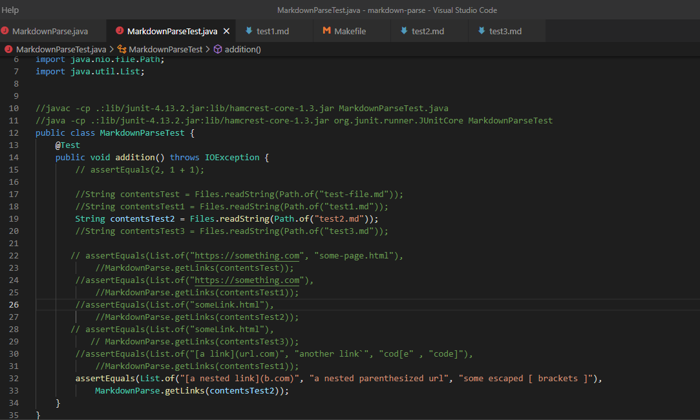
2. The markdown-parse we reviewed:
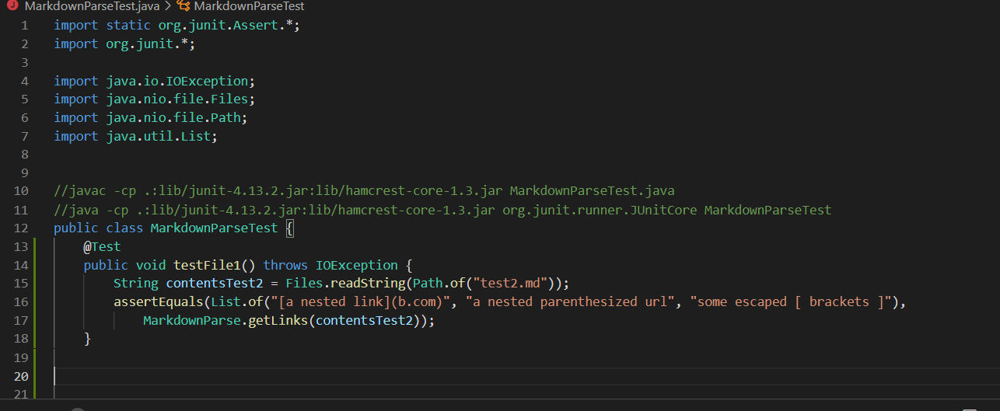
#### For your implementation, the corresponding output when running the tests; if it passed, say so. If it didn’t pass, show the specific part of the JUnit output that shows the test failure.
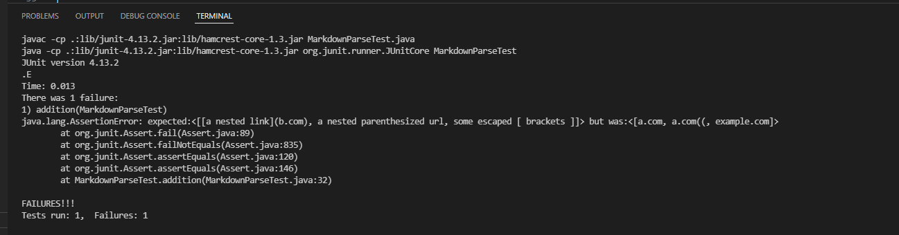
#### For the implementation you reviewed, the corresponding output when running the tests; if it passed, say so. If it didn’t pass, show the specific part of the JUnit output that shows the test failure.
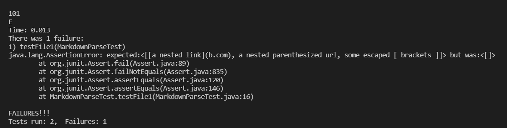

---

### Snippet 3
#### Decide on what it should produce by using either VScode preview or the CommonMark demo site
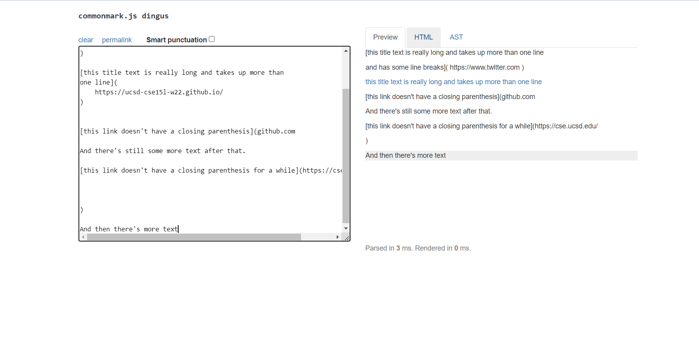
#### Showing the code in MarkdownParseTest.java for how you turned it into a test
1. My markdown-parse:
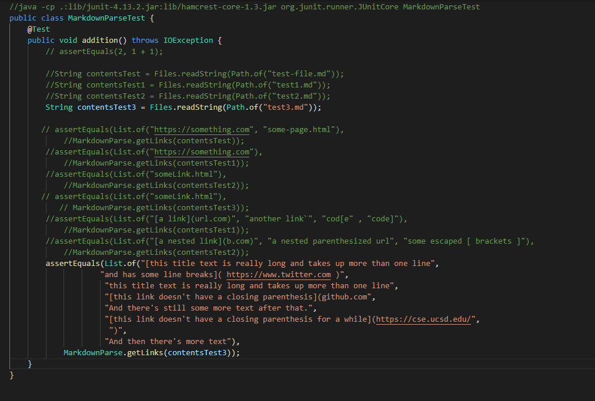
2. The markdown-parse we reviewed:
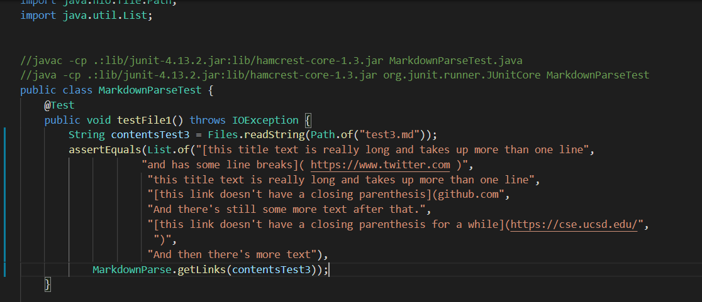
#### For your implementation, the corresponding output when running the tests; if it passed, say so. If it didn’t pass, show the specific part of the JUnit output that shows the test failure.
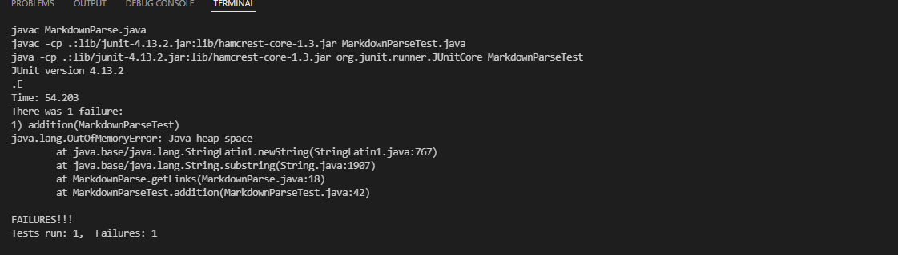
#### For the implementation you reviewed, the corresponding output when running the tests; if it passed, say so. If it didn’t pass, show the specific part of the JUnit output that shows the test failure.
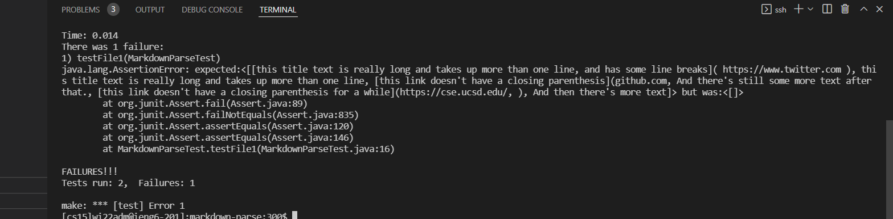

---
### Follow-up Questions
#### Do you think there is a small (<10 lines) code change that will make your program work for snippet 1 and all related cases that use inline code with backticks? If yes, describe the code change. If not, describe why it would be a more involved change.
I am getting an incorrect output for snippet 1. My current MarkdownParse doesn't recognize that "another name" should be the label for the link that comes after it. It woudl take a bit more code to take into account the various positions the backticks could be and how that impacts whether the link is valid or not to print out.
#### Do you think there is a small (<10 lines) code change that will make your program work for snippet 2 and all related cases that nest parentheses, brackets, and escaped brackets? If yes, describe the code change. If not, describe why it would be a more involved change.
To fix issues with nest parentheses, we need make sure the count is even for the number of open and close parentheses. Also, we need to check that if the brackets are followed by (), then the words in the brackets will be the words for the link.

#### Do you think there is a small (<10 lines) code change that will make your program work for snippet 3 and all related cases that have newlines in brackets and parentheses? If yes, describe the code change. If not, describe why it would be a more involved change.
The error that I got was a Java Heap Space which means that the file was too large to handle in this case. Therefore, it would probably take a bit larger of a change to fix this. In addition, to handle the newlines in parentheses, we need to look for that character and prompt a new line.

---
---
---