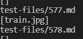
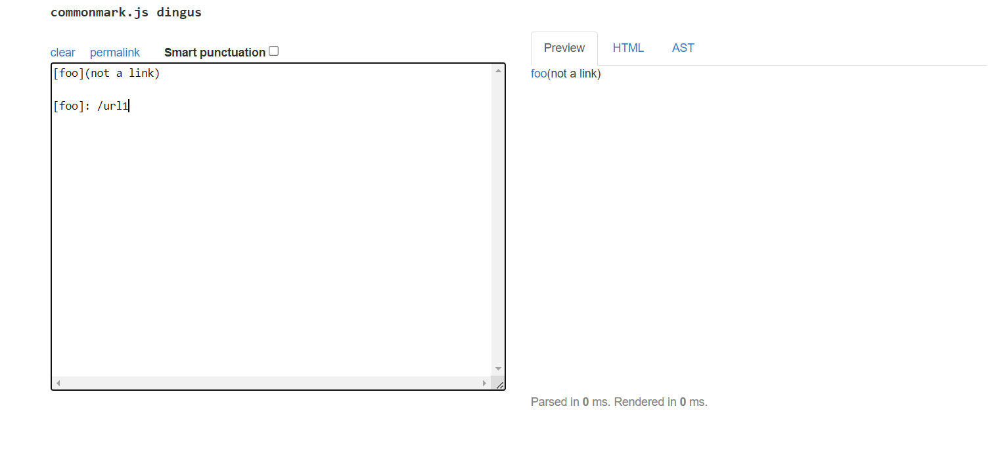

# **Week 10 ~ Lab Report 5**
## Table of Contents
* Found Test Cases
* Bug 1
* Bug 2

---
---
---
### Found Test Cases
How you found the tests with different results (Did you use diff on the results of running a bash for loop? Did you search through manually? Did you use some other programmatic idea?)

I first ran bash script.sh in the given implementation and stored it in results.txt in folder week9. Then, I cloned my version of the implementation int folder week9_mine. Here, I copied over script.sh and test-files. Then, I ran the bash script.sh command and also stored it in results.txt. After, I compared the two files in the week9 folder using diff results.txt week9_mine/markdown-parse/results.txt and stored the results into output.txt. Looking through output.txt, I was given the lines where there was a difference in the two different results.txt files. I was able to trace the files and find which test cases it corresponded to.

* Test 1: 577.md
* Test 2: 567.md

### Bug 1 : 577.md
Describe which implementation is correct, or if you think neither is correct, by showing both actual outputs and indicating what the expected output is.
For the implementation that’s not correct (or choose one if both are incorrect), describe the bug (the problem in the code). You don’t have to provide a fix, but you should be specific about what is wrong with the program, and show the code that should be fixed.

#### My Implementation Result for 577.md:

#### Given Implementation Result for 577.md: 

#### Actual Output for 577.md: 

Explanation: 

My implementation outputs an empty array while the given implementation outputs [train.jpg]. However, the actual output should be a picture with label "foo". Therefore, neither implementation is correct. In the given implementation, it outputs whatever is between [] because it assumes that it is a link. We need to specifically check if there is a "!" in the first position before the nextOpenBracket. Then, it wouldn't be a potential link as it would become an image. 
We need to add a check around line 70 checking if the first character is "!" before [ and it wouldn't be a link. Then, if ![ are right next to each other, it should be seen as an image not a link. 

---
---
### Bug 2 : 567.md
Describe which implementation is correct, or if you think neither is correct, by showing both actual outputs and indicating what the expected output is.
For the implementation that’s not correct (or choose one if both are incorrect), describe the _bug (the problem in the code). You don’t have to provide a fix, but you should be specific about what is wrong with the program, and show the code that should be fixed.

#### My Implementation Result:

#### Given Implementation Result: 

#### Actual Output: 

Explanation: 

My implementation gives [not a link] while the given implementation outputs []. The actual output should be foo(not a link). This is because there are spaces in the url within () so it isn't recoginized as a link. "foo" has been recognized as the title for the link, but the part in () is also printing as if it isn't part of the link. 
My implementation doesn't replace the URL with the title given between[]. It also doesn't check that there are spaces within the URL. However, even without that, it should have replaced the URL portion with "foo". In order to fix this, we would have to add a check after line 22 where after we have determined something as a valid link, we go back and check if there was anything between [] which is what should be printed out. In addition, we should also have a check that checks if there are spaces in () because it wouldn't be a valid link otherwise. 

